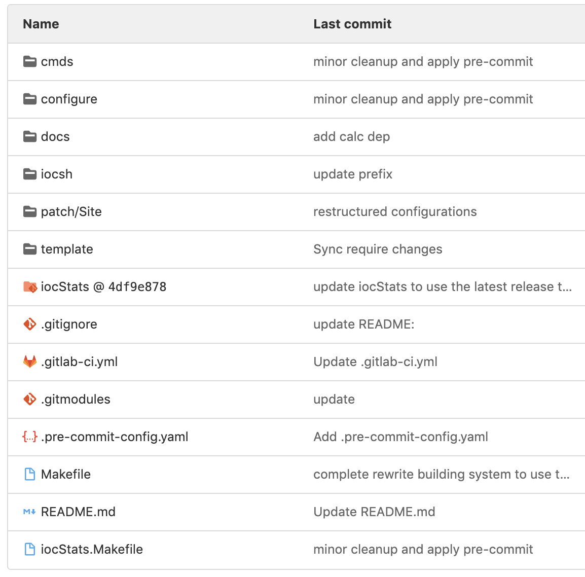

# Anatomy of an e3 module

## Lesson Overview

In this lesson, you'll learn how to do the following:

* Understand why e3 wrappers don't hold any source code.
* Understand the anatomy of an e3 wrapper.
* Learn how to apply and create patch files for EPICS base and other modules within e3.

---

## No source code - configuration files!

By design, e3 wrappers typically have no source code in their repositories. Instead, they consist of configuration files, utility scripts, and other necessary
files to build and to load the module functionality. This is what allow us consistent building of environments from source code, modules, applications, kernel
drivers, etc., which in turn can be hosted elsewhere.

:::{note}
It should be noted that an e3 wrapper **can**, however, hold source code. This is known as *local mode*, and will be discussed more in-depth later.
:::

As descrbied in [Chapter 3](3_module_versions.md), an e3 module wrapper links to a specific commit in a source repository. This allows us to build, for example,
*StreamDevice* 2.8.18 at one point, and to later build 2.8.20 by simply changing a few lines in the configuration files.

## Directory anatomy

Let's have a look at `e3-iocStats/`:

```console
[iocuser@host:e3-iocStats]$ tree -L 1
.
|-- cmds
|-- configure
|-- docs
|-- iocsh
|-- iocStats
|-- iocStats.Makefile
|-- Makefile
|-- patch
|-- README.md
`-- template
```

Although there is some variation amongst e3 modules, the majority of them have the following contents.

* `cmds/` Customized startup scripts that are often used for testing a module.

* `configure/` Configuration files, including information about which version to build and what the module depends on

* `docs/` For documentation, log files, and similar material.

* `iocsh/` Site-specific startup script "snippets". These should be installed with the module and are, in a sense, the module's API.

* `<MODULE_NAME>/` A git submodule link to source repository.

* `<MODULE_NAME>.Makefile` The (e3) makefile for the module. This consists of instructions for which source files to compile, header files to install, etc.

* `patch/` Site-specific patches can be included here.

* `template/` Site-specific database, template, substitution, and protocol files.

Note in general that the wrapper should contain site-specific files that are used to build and to complement a community module - a number
of these directories will also exist within the module, so there will inevitably be some judgement as to where a given `.iocsh` file should
be placed, for example.

### The underlying git submodule

In order to allow us to separate the community module from the site-specific build instructions, we include the community module as a
git submodule. It is important to have at least some passing familiarity with git submodules. If you have not already done the exercise
from [Chapter 1](1_installing_e3.md) on git submodules, it is encouraged to read more about them from the
[official git documentation](https://git-scm.com/book/en/v2/Git-Tools-Submodules).

Assuming that you are still in the `e3-iocStats` directory, let us explore some of the submodule there. Start by running the following command.

```console
[iocuser@host:e3-iocStats]$ git submodule status
```

The output should be something like ` 4df9e87815f6a9432955a3ddb45fafa9fe4a4d40 iocStats (3.1.15-22-g4df9e87)`.

:::{admonition} Excercise
What do each of these parts represent?
:::

Next, look at the wrapper repository for [iocStats](https://gitlab.esss.lu.se/e3/wrappers/core/e3-iocStats.git) on Gitlab.

The magic number is **4df9e878** - can you see what it refers to? After finding it, verify this number in the output of `git submodule status`. 

||
| :---: |
|**Figure 1 -** A screenshot from iocStats' Gitlab page. |

Finally, examine its submodule configuration:

```console
[iocuser@host:e3-iocStats]$ more .gitmodules
[submodule "iocStats"]
         path = iocStats
         url = https://github.com/epics-modules/iocStats
         ignore = dirty
```

In this configuration file, you can see where we link to the remote module location. This is where you change the path in case
the module has moved.

e3 uses `git submodule` to import one repository (the community EPICS module) into another (the e3 wrapper). However, the commit hash that is used to link
these two repositories is *not* what is used to build the module. When you build and deploy the module, the submodule will first be checked out at the commit
defined by `EPICS_MODULE_TAG`. In a perfect world these two should point at the same commit, but it is possible that they do not. This can result
in some strange-looking errors, which can often be resolved by running `make init` upon cloning a wrapper repository.

:::{note}
We should note that this "redundancy" is a curious design feature that is being revisited by the e3 team.
:::

As denoted in [Chapter 1](1_installing_e3.md), the standard make targets to build and deploy a module are
* `make init`
* `make patch`
* `make build`
* `make install`

The following additional `make` targets are of particular importance when working with an e3 module.

* `make vars`: Prints out a list of relevant environment variables. Useful for debugging the environment.
* `make debug`: Runs a debug of the build process, printing out the values of certain intermediate build variables.
* `make clean`: Deletes all of the temporary build files.
* `make uninstall`: Removes the current module version (as defined in `CONFIG_MODULE`) from the e3 environment.
* `make test`: Attempts to load the current module into an IOC, and runs any module-specific tests that have been defined.
* `make cellinstall`: Installs the module in a local path (useful if you do not have write permissions to your e3 environment location). More on this in [Cell Mode](_file_does_not_exist.md)

## Patch files

Due to the fact that we are working with community modules over which we do not have complete control, we may sometimes need to modify them to fit the needs of
our specific site. This is done with patch files, which are stored in the `patch/` subdirectory.

:::{note}
If you are unfamiliar with patch files, take a look at this [wikipedia page](https://en.wikipedia.org/wiki/Patch_(Unix)). In short, differences between two versions of a file can be saved separate from the file and applied when necessary.
:::

In order to work with patch files, there are a number of commands built into e3. Let us look at a few patch files and see how to work with them.

### Patch files in EPICS (e3) base

```console
[iocuser@host:e3]$ find e3-base/ -name *.patch | grep "7\.0\.5"
e3-base/patch/Site/R7.0.5/softIocPVA.p0.patch
e3-base/patch/Site/R7.0.5/ess_epics_host_arch.p0.patch
e3-base/patch/Site/R7.0.5/config_site-x86_84_c++11.p0.patch
e3-base/patch/Site/R7.0.5/enable_new_dtags.p0.patch
e3-base/patch/Site/R7.0.5/os_class.p0.patch
e3-base/patch/Site/R7.0.5/remove_mkdir_from_rules_build.p0.patch
e3-base/patch/Site/R7.0.5/add_pvdatabase_nt_softIocPVA.p0.patch
```

The patch files that would be stored in `e3-base/patch/R7.0.5` are EPICS community patch files. These are due to issues that have been resolved
at the community level, but have not yet made it into a release of EPICS base. At the moment, new releases of EPICS base are occurring several 
times per year, so there has been less of a need to populate this directory.

The patch files in `e3-base/patch/Site/R7.0.5`, in contrast, are for site-specific purposes. These are changes that are not to fix issues with
EPICS base that have been identified, but for changes that are necessary for e3 to function properly. An example is `remove_mkdir_from_rules_build.p0.patch`:
```diff
diff --git configure/RULES_BUILD configure/RULES_BUILD
index 0735f5598..3977a6a03 100644
--- configure/RULES_BUILD
+++ configure/RULES_BUILD
@@ -327,7 +327,7 @@ $(LOADABLE_SHRLIBNAME): $(LOADABLE_SHRLIB_PREFIX)%$(LOADABLE_SHRLIB_SUFFIX):
 
 $(LIBNAME) $(SHRLIBNAME) $(LOADABLE_SHRLIBNAME): | $(INSTALL_LIB)
 $(INSTALL_LIB):
-	@$(MKDIR) $@
+#	@$(MKDIR) $@
 
 #---------------------------------------------------------------
 # C++ munching for VxWorks
```
which modifies the default EPICS build rules in order for e3 to build properly.

:::{note}
While the EPICS community use `p0` files for base 3.15.5, and `p1` files for base 3.16.x, e3 only supports use of `p0` files for compatability reasons. <!-- TODO: Figure out what the story behind this is. -->
:::

In order to apply patches to EPICS base (which one should always do before building), you simply run `make patch`. This will apply all of the patches 
(both from `patch/` and `patch/Site`) for the current version of EPICS base. Thus, the proper commands to build and install EPICS base with e3 is

```console
[iocuser@host:e3-base]$ make init
[iocuser@host:e3-base]$ make patch
[iocuser@host:e3-base]$ make build
[iocuser@host:e3-base]$ make install
```

These steps are all performed when you run

```console
[iocuser@host:e3]$ ./e3.bash base
```

### Patch files for e3 modules

:::{note}
Note that this is current as of require 3.4.1. The patching system will be slightly modified for require 4.0.0.
:::

Patch files for EPICS (e3) modules are very similar to those for EPICS base, and are applied with the same method. The main difference is that
there is no distinction between site-specific patches and community patches, and so all of the patch files are expected to be found in the path
`patch/Site/` within a given wrapper. 

```console
[iocuser@host:e3]$ find . -name *.p0.patch | grep -v e3-base | sort -n
./area/e3-ADAndor3/patch/Site/2.2.0-include-stdlin.h.p0.patch
./area/e3-ADSupport/patch/Site/.1.4.0-tiff_extern_rename.p0.patch
./area/e3-ADSupport/patch/Site/.1.6.0-tiff_extern_renam.p0.patch
./area/e3-ADSupport/patch/Site/.1.7.0-tiff_extern_renam.p0.patch
./area/e3-ADSupport/patch/Site/1.9.0-netcdf-config-header-rename.p0.patch
./area/e3-ADSupport/patch/Site/1.9.0-rename.p0.patch

# --- snip snip ---
```

The format for patch files names is `${E3_MODULE_VERSION}-description.p0.patch`. Patches should have descriptions in the file `HISTORY.md` that describes their purpose.

In general, if one is providing a genuine fix to a community module then it is best to submit a pull/merge request to that module and fix it for everything. However,
if the change is truly a site-specific one (for example, ADSupport is built differently in e3 than in EPICS base in a way that requires patching), then one should use
patch files instead.

Similar to `e3-base`, one applies the collection of patches for a given version with `make patch`. This means that the correct build sequence for an e3 module is

```console
[iocuser@host:e3-iocStats]$ make init
[iocuser@host:e3-iocStats]$ make patch
[iocuser@host:e3-iocStats]$ make build
[iocuser@host:e3-iocStats]$ make install
```

For both `e3-base` and any e3 module, you revert patches with the command `make patchrevert`. If there are no applicable patches, then you will see the
message
```console
[iocuser@host:e3-iocStats]$ make patch
>>> No patches to apply
```
If your patches have already been applied, then you will get an error message.

### How to create a patch file

If you want to create a patch file for an e3 module, run `git diff --no-prefix > ../patch/Site/` from the root directory of the module, e.g.:

```console
[iocuser@host:iocStats]$ git diff --no-prefix > ../patch/Site/3.1.16-add_more_stats.p0.patch
```

Make sure that the patch file name has the correct version (3.1.16, from `CONFIG_MODULE`) and a useful description, and make sure that you update the `HISTORY.md` file
explaining the purpose and role of the patch.

---

## Assignments

* Where are the e3 make targets defined? What are some other targets that might be of interest?
* Can you override the `EPICS_MODULE_TAG` to build a different version without any `git status` changes in `e3-iocStats`? The output of `git status` should look like
  
  ```console
  [iocuser@host:e3-iocstats]$ git status
  On branch master
  Your branch is up-to-date with 'origin/master'.
  nothing to commit, working directory clean
  ```

* What is the difference between a `p0` patch and `p1` patch? Is it the same in EPICS as generally with UNIX patch files?

